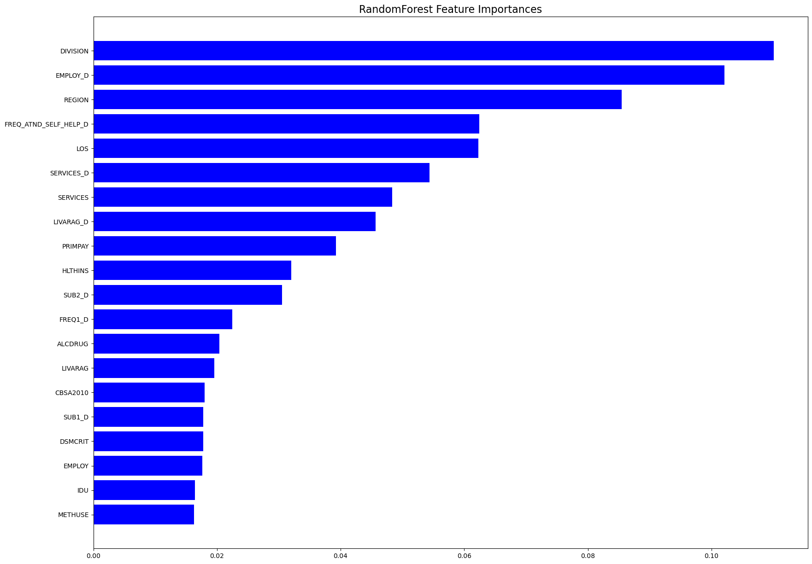
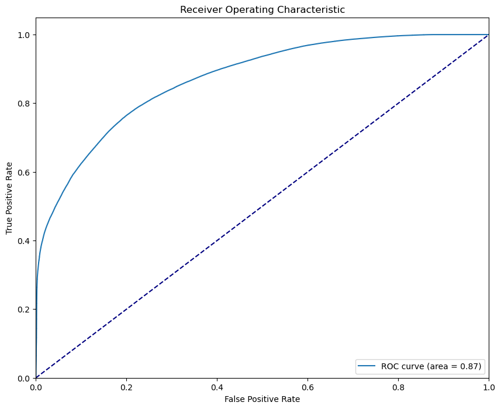

# Project-2-Group-2

Addiction recovery statistics by Beau, Terry, and Matthew for Project 2 Group 2

## Project_Documentation

### Create links to Interview questions, customer testing, QA capture, create a definitions file for business operations, project intake form (KPI's or elements that are not measurable i.e. feelings), client intake questionnaire

## Patient Questionnaire Application

This application is designed to collect and save patient questionnaire data using Python's tkinter GUI toolkit and pandas library.

### Getting Started

Prerequisites

Make sure you have the following Python libraries installed:

- pandas
- tkinter (should be included in standard Python installations)

You can install these libraries using pip:

'''pip install pandas'''

**Usage**

1. Clone this repository to your local machine or download the source code.
2. Navigate to the project directory.
3. Run the Python script patient_questionnaire.py.
4. The application window will open, allowing you to input patient questionnaire data.
5. Fill in the required information and click the "Save" button to save the data.
6. Data will be saved as CSV files in the Patient_Questionnaire_Data directory, with each file named after the patient's case ID.

**Features**

- Collects various patient information including personal details, treatment information, and substance use information.
- Provides dropdown menus for selecting options where applicable.
- Saves data to CSV files, organized by case ID.

---

## Large Dataset

Dataset 1

https://www.samhsa.gov/data/data-we-collect/samhda-substance-abuse-and-mental-health-data-archive
samhsa.gov
Substance Abuse and Mental Health Data Archive
Get Access: NSDUH Restricted-use Data SAMHSA has partnered with the National Center for Health Statistics (NCHS) to host restricted-use National Survey on Drug Use and Health (NSDUH) data at their Federal Statistical Research Data Centers (RDCs). RDCs are secure facilities that provide access to a range of restricted-use microdata for statistical purposes. SAMHSA is the most recent federal partner to work with NCHS in making NSDUH restricted-use microdata available to approved researchers at RDC sites.

License Requirements:

_Privacy of Study Respondents_

> Any intentional identification of an individual or organization, or unauthorized disclosure of
> identifiable information, violates the promise of confidentiality given to the providers of the
> information. Disclosure of identifiable information may also be punishable under federal law.
> Therefore, users of data agree to:
> Use these data sets solely for research or statistical purposes, and not for investigation or re-
> identification of specific individuals or organizations.
> Make no use of the identity of any individual discovered inadvertently, and report any such discovery
> to SAMHSA (BHSIS_HelpDesk@eagletechva.com).

_Public Domain Notice_

> All material appearing in this document is in the public domain and may be reproduced or copied
> without permission from SAMHSA. Citation of the source is appreciated. This publication may
> not be reproduced or distributed for a fee without specific, written authorization of the Office of
> Communications, SAMHSA, U.S. Department of Health and Human Services.

## Micro Dataset

The micro-dataset is an output of our patient_questionnaire.py application. The application saves a file to our Patient_Questionnaire_Data folder. The file is read into mathew_watkins.ipynb Jupiter notebook for processing

> Note: Future development in process has the make_a_prediction.py read the micro-dataset into the new application to run in a more automated manner.

## Overview of the Analysis

From the cleaned dataset and a lot of trial and error the qualities that have the greatest impact were Marital status, employment status, living arrangements, services they were receiving, when they first used, how committed they were to attending self help programs afterward, the primary source of payment for the program, what census division they were in, pregnancy, and whether or not an opiate assisted program was used.

### Analysis

#### Base Performance of Model Selection

Several models were tested for accuracy scores against the cleaned Dataframe

test_model(LinearRegression(), data)
test_model(KNeighborsRegressor(), data)
test_model(RandomForestRegressor(), data)
test_model(ExtraTreesRegressor(), data)
test_model(AdaBoostRegressor(), data)
test_model(SVR(C=1.0, epsilon=0.2), data)

Results:
Model: LinearRegression
Train score: 0.1937139216941649
Test Score: 0.19216585243099527

Model: KNeighborsRegressor
Train score: 0.5378006263686466
Test Score: 0.29855960172606644

Model: RandomForestRegressor
Train score: 0.927633723215378
Test Score: 0.481623989699713

Model: ExtraTreesRegressor
Train score: 1.0
Test Score: 0.4840360094581453

Model: AdaBoostRegressor
Train score: 0.07484674836756333
Test Score: 0.07385510906138937

_MODEL ANALYSIS AND EXPLORATION_
Data Preparation

- Drops the target variable ‘REASON’ from the dataset to create feature set ‘X’.
- Assigns the target variable ‘REASON’ to ‘y’.
  Data Splitting
- Splits the dataset into training and testing sets using an 80-20 split with ‘train_test_split’.
  Data Scaling
- Initializes a ‘StandardScaler’ to standardize the features.
- Fits the scaler on the training data and transforms both training and testing sets.
  Model Initialization
- Creates a ‘RandomForestClassifier’ with specified parameters.
  Model Training and Prediction (RandomForest)
- Trains the RandomForest model on the training data.
- Makes predictions on both training and testing sets.
- Calculates and prints the accuracy for both training and testing sets.

_ACCURACY SCORES_

The RandomForest achieved a training accuracy of 78.84.% and a testing accuracy of 78.74%, indicating a strong performance and minimal overfitting.

_RANDOMFOREST FEATURE IMPORTANCES_

The RandomForest showed that DIVISION, EMPLOY_D, REGION, AND FREQ_ATND_SELF_HELP_D are the most important factors for making accurate predictions.

_RandomForest Cross-Validation Accuracy: 0.7875453017892988_

## Summary and Conclusions

Through the use of AI prediction models, we were able to predict the success rate of patients at a far higher rate than the House of Hope was seeing

Along the way we also gained valuable insight into what was and was not important as far as factors in weather a person can have success or not

We also gained insight into what any person should focus on if they are seeking freedom from any addiction regardless of drug

In the future and with more time I’d like to see if we can manipulate the prediction model to give each individual targeted goals for finding the greatest success
